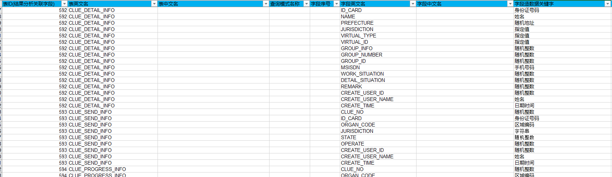
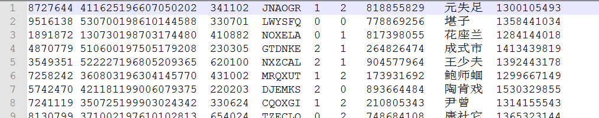
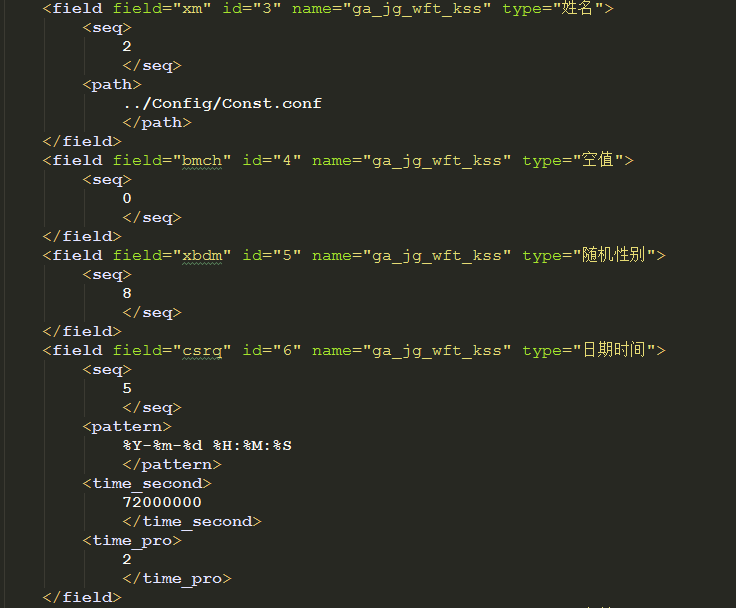

# 写在前面的话

&emsp;前两年因涉及在公司环境测试MR逻辑等，涉及400多张表造数据的问题，所以写了这样的一个工具，可以支持生成nb、txt等文本数据文件，也可以通过配置生成关系型数据库sql，当然，大家在使用过程中，也可以很方便根据自己的需要扩充该造数据工具的关键词库。考虑到大家都是会使用Python的，所以该工具未提供任何web界面或客户端界面，只能通过命令行或者Pycharm等方式运行。  
&emsp;当前因团队成员越来越多，亟需针对ZA产品测试团队的情况生成大量测试数据，所以还是有必要尽早将readme产出，希望能方便大家在测试过程中根据readme指导自行使用该工具，若仍存在问题的，可以随时联系。

# 代码运行环境构建

1. 若要使用该平台时，需要安装64位python2.7环境或联系测试部汪啸涛获取env虚拟环境
2. 在代码所在目录执行，其中--find-links需要修改为AllPackages所在目录 
    pip install -r requirements.txt -I --no-index --find-links=AllPackages所在路径
3. 数据生成请先在/Config/table_fields.xls配置字段类型，在/Config/config.conf配置table_name字段，然后运行/main/run.py即可生成所需txt或者nb文件；如果字段不符合需求，可以在/Conf/data_task.conf配置字段参数，修正数据类型

# 代码功能介绍

&emsp;&emsp;该工具主要作用是方便业务测试过程中数据的构造，大数据应用项目存在较多部分功能需要造大量数据，耗时耗力，所以设计该工具，简化数据构造过程。该工具主要通过读取Excel表字段，通过指定各字段关键词，自动生成符合要求的数据类型。该工具主要支持构造的数据类型如下： 
&emsp;&emsp;1. 可构造后缀为nb、bcp、txt等文本类格式数据，文本分隔符自定义； 
&emsp;&emsp;2. 支持构造生成数据SQL，使用使用直接拿着对应SQL文件去需要生成数据的数据库执行即可。

# 使用说明

## 通过Excel进行表配置

1. 首先找到./src/Config/table_fields.xls，配置表英文名，字段英文名，并选择字段造数据关键字，如下图所示：
   

2. Excel表格表信息配置完成后，配置./src/Config/config.conf，在table_name配置刚刚配置的表英文名，多张表可使用英文逗号分隔
   

3. 运行run.py函数，查看生成的数据效果
   
   
   ## 生成造数据xml并对数据字段进行优化
   
   &emsp;&emsp;我们目前是利用默认参数生成了一批数据，但这样的数据可能并不能完全满足我们的业务需要，所以我们可以根据业务需要对相关字段进行定制化配置，配置步骤如下： 

4. 找到./src/Config/data_task.xml 

5. 翻到xml最后，找到刚刚生成的表配置，针对各个字段进行定制化配置 
    

6. 配置完成后，即可生成自己所需的数据类型 
   
   ## 代码运行配置解读
   
    [data_platform]
   
   # 根据excel自动生成数据xml配置文件及数据相关配置
   
   # 表结构文档中数据类型字段所在列
   
    config_col = 8
   
   # 所字段开始行和结束行，填写表英文名后可以不填写
   
    start_row = 2311
    end_row = 2370
   
   # 表结构文档相对路径
   
    excel_path = ../Config/table_fields.xls
   
   # 需要添加数据的表英文名，多个英文名可以用英文半角逗号（,）分隔
   
    table_name = CLUE_SEND_INFO,CLUE_PROGRESS_INFO,OPZ_PERSON_TMP
   
   # 字段英文名在excel中的列数
   
    field_col = 6
   
   # 需要生成的文件的行数
   
    txt_line = 10
   
   # 生成文件的格式，修改文件格式也要同步修改文件分隔符，同时可以选择生成.sql文件，即生成插入数据的sql
   
    format = .txt
   
   # format = .sql
   
   # 文件字段分隔符，默认为\t（为\t时无需填写！！）,当选择生成文件格式时，注意文件字段分隔符也要同步修改
   
    field_split =
   
   ## 关键词说明
   
   &emsp;已支持的关键词有：随机整数,航班号,日期时间,机场三字码,随机地址,姓名,字符串,身份证号码,空值,随机性别,手机号码,指定值,民族,邮箱,IMSI,IMEI,MAC地址,IP地址,网站域名,业务库身份证,火车车次,区域编码,区域编码-地名
   
   ### 关键词代码位置
- 关键词与xml配置文件关联函数位置：./src/dataDao/txt_data_birth.py
   

- 关键词函数所在位置：./src/dataDao/Randconstants.py 
  &emsp;若要添加关键词，可以现在Randconstants函数中添加关键词生成函数，然后通过在txt_data_birth.TxtBirth.mapping_func与xml配置文件进行关联，这样就可以读取xml中函数生成自己想要的数据了。举例如下：
  
        def random_username(self, num=1, path='../Config/Const.conf'):
        """
        随机生成用户姓名
        调用方法
        例1：
        for i in random_username(num=1000):
            print i
        :param num: 迭代的次数
        :param path: 配置文件地址
        :return:
        """
        if os.path.exists(path):
            pass
        else:
            yield
        lns = list(eval(self.cul.get_config('attribute_conf', 'hundred_Family_name', path)))
        fns = list(eval(self.cul.get_config('attribute_conf', 'commonUse_Chinese', path)))
        __i = 1
        while __i <= num:
            _last = self.__random_name(1, lns)
            __i += 1
            yield "{}{}".format(_last, self.__first_name(random.randint(1, 2), _last, fns))

### 部分关键关键词用法说明

#### 身份证号

        def random_credit_id(self, num=1, digit=18, start="1960-01-01", end="2016-12-30", area=None):
        """
        随机生成身份证号码，可根据传参确定生成的身份证号码位数
        :param num: 生成的身份证号迭代对象个数
        :param digit: 生成的身份证号码的位数
        :return:
        """
        if area == "None":
            area = None
        __i = 1
        while __i <= num:
            __i += 1
            if int(digit) == 18:
                yield Random_CreditID.getRandomIdNumber(start=start, end=end, area=area)
            elif int(digit) == 15:
                yield self.cul.new2old(Random_CreditID.getRandomIdNumber(start=start, end=end, area=area))
            else:
                pass

身份证号对应的xml配置如下：

            <field field="id_no" id="3" name="t_ap_gab_hcdpxx_pocket" type="身份证号码">
            <seq>
                1
                </seq>
            <digit>
                18
                </digit>
            <front-2>
                None
                </front-2>
            <year-start>
                1960-01-01
                </year-start>
            <year-end>
                2016-12-30
                </year-end>
        </field>

&emsp;由以上代码与配置相比可以看出，xml和身份证号关键词函数的配置是一一对应的，我们在Excel填写完表的配置后，生成的xml配置是该函数默认配置，但有时我们因项目所需，默认配置不能满足我们造数据的需求，那么我们可以对于xml中的函数配置进行修改，修改后函数将根据xml中的配置生成符合我们需要的新数据。

#### 字符串

- 随机返回一组字母和数字组成的字符串

- :param all_num: 字符总数,不超过16位，小写字母数+数字位数不超过字符总数

- :param low_case: 是否包含小写字母

- :param digits_num：包含数字的位数，最多不超过总数-小写字母数

- :return: 例：'CMJN0S'
  
        <field field="seat_no" id="11" name="t_ap_gab_hcdpxx_pocket" type="字符串">
            <seq>
                7
                </seq>
            <lower_case>
                0
                </lower_case>
            <digits_num>
                0
                </digits_num>
            <case_num>
                6
                </case_num>
        </field>
